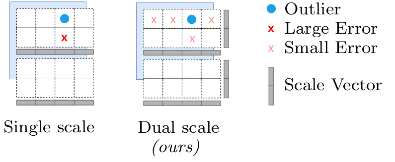
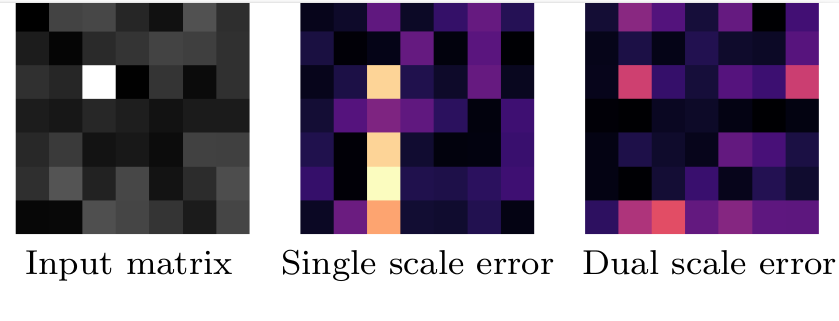

[](https://arxiv.org/abs/2509.22944)
[](https://opensource.org/licenses/Apache-2.0)
[](https://github.com/huawei-csl/SINQ/stargazers)
[](https://huggingface.co/huawei-csl)


<table border="0" cellspacing="0" cellpadding="0">
  <tr>
    <td></td>
    <td style="vertical-align: middle;"><h1>SINQ: Sinkhorn-Normalized Quantization for Calibration-Free Low-Precision LLMs</h1></td>
  </tr>
</table>


> ⚡️ **A fast, plug-and-play, model-agnostic quantization technique** delivering **state-of-the-art performance** for Large Language Models **without sacrificing accuracy.**

> 💡 **Want to run a large model on your GPU but don’t have enough memory?** With **SINQ**, you can deploy models that would otherwise be too big **drastically reducing memory usage while preserving LLM quality.**

> ⏱️ SINQ quantizes **Qwen3-14B** in just **~21 sec** and **DeepSeekV2.5-236B** in **~5 min**

---

🆕 [17/10/2025] **First models on 🤗 Hugging Face Hub:**
> We’ve started uploading our first pre-quantized models to the 🤗 [**Hugging Face Hub**](https://huggingface.co/huawei-csl) and will continue adding more soon.
>  **Note: We’re also actively working to add support for popular frameworks such as <code>vLLM</code>, <code>SGLang</code>, and <code>llama.cpp</code> to enable fast SINQ-ference** (sorry for the joke).  
> In the meantime, you can ⭐️ **star** and **watch** the repo to stay updated!
---

## 🚀 Welcome to the **official SINQ repository**!
  
**SINQ** (Sinkhorn-Normalized Quantization) is a **novel, fast and high-quality quantization method** designed to make any Large Language Models **smaller** while keeping their accuracy almost intact.

### 🔍 What You’ll Find Here

- [1. How does SINQ work?](#1-how-does-sinq-work)
- [2. Why should I use SINQ?](#2-why-should-i-use-sinq)
- <u>[3. Quantize (and save) any LLM with SINQ](#3-quantize-any-llm-with-sinq)</u>
- [4. How to reproduce paper results](#4-how-to-reproduce-paper-results)
- [5. Ongoing updates on new features and integrations](#5-ongoing-updates-on-new-features-and-integrations)
- [6. How to Cite This Work](#6-how-to-cite-this-work)
- [7. Related Repositories](#7-related-repositories)

#### 📊 Feature Comparison: SINQ vs HQQ _(calibration-free)_ and A-SINQ vs AWQ _(calibrated)_

| Feature | **SINQ** | **HQQ** | **A-SINQ** | **AWQ** |
|------------|:--------:|:--------:|:----------:|:-------:|
| 🎯 Calibration | Calibration-free | Calibration-free |  Calibrated | Calibrated |
| 🧮 Quantization Type | Symmetric & Asymmetric | Asymmetric only | Symmetric & Asymmetric | Symmetric & Asymmetric |
| 📦 NF4 Support | **Yes** | No | **Yes** | No |
| ⚡ Quantization Speed | ~2× **Faster** than HQQ | Slower | ~4× **Faster** than AWQ | Slower |
| 📈 Model Quality | **Higher** | Lower | **Higher** | Lower |


📄 **Want to know more?** Read our paper on [**arXiv**](http://arxiv.org/abs/2509.22944)!


---

## 1. How does SINQ work?

<details>
<summary>Click to expand a quick explanation of SINQ’s core idea</summary>

#### 1️⃣ Dual-Scaling for Better Quantization

<p align="left">
  
</p>

Conventional quantization uses **one scale per weight dimension**, which makes models vulnerable to **outliers**: large weights that distort scaling and cause significant errors.

**SINQ** solves this by introducing **dual scaling**: separate scale factors for **rows and columns**. This flexibility redistributes outlier influence and keeps quantization errors smaller and more balanced.

---


#### 2️⃣ More Even Error Distribution

<p align="left">
  
</p>

With standard single-scale quantization, errors tend to **cluster around outliers**.  
With **SINQ**, they become **spread out and less severe**, preserving model accuracy even at **3 bit precision**. This improvement is driven by SINQ’s **Sinkhorn-normalized optimization**, which iteratively rescales rows and columns to balance their variance - a process inspired by Sinkhorn matrix normalization. By reducing the overall **_matrix imbalance_** (refer to the paper for more info), weights become inherently easier to quantize, leading to more stable behavior across layers and consistently higher accuracy even at very low bit-widths.


</details>

---
## 2. Why should I use SINQ?
<details>
<summary>Click to expand a quick explanation on why you should use SINQ to quantize your LLM</summary>


#### **SINQ (calibration-free)**  
- **Higher LLM quality** and **~2× faster** quantization than **HQQ** 
- **>31× faster** quantization process and comparable or better LLM quality compared to **AWQ / GPTQ**
- **Model-agnostic**: works without knowing the specific LLM architecture, unlike **QuaRot**  
- **Training-free**: it does not require end-to-end training, unlike **SpinQuant** or **KurTail** 
- **Additionally, A-SINQ (calibrated)** further **beats AWQ, GPTQ, and Hadamard+GPTQ** on quality while achieving **>4× faster** quantization time.

**Example**  
- ⏱️ SINQ quantizes **Qwen3-14B** in just **~21 sec** and **DeepSeekV2.5-236B** in **~5 min** on a single GPU
- 💾 Enables you to **run DeepSeekV2.5-236B** on a single GPU with **~110 GB** of memory (vs ~472 GB) while losing **< 1 ppl** on **WikiText2** and **C4**
</details>

## 3. Quantize any LLM with SINQ

### Setup & Quick Start

First, install the dependencies and set up the package:

```bash
# 1. Clone the repository
git clone https://github.com/huawei-csl/SINQ.git
cd SINQ

# 2. Install dependencies
pip install -r req.txt

# 3. Install SINQ
pip install .
```

---

### Quantize in a few lines

Quantizing any 🤗 Hugging Face model with SINQ is simple and takes only a few lines of code:

```python
import torch
from transformers import AutoTokenizer, AutoModelForCausalLM
from sinq.patch_model import AutoSINQHFModel
from sinq.sinqlinear import BaseQuantizeConfig

model_name = "Qwen/Qwen3-1.7B"
model = AutoModelForCausalLM.from_pretrained(model_name, torch_dtype=torch.bfloat16)
tokenizer = AutoTokenizer.from_pretrained(model_name)

quant_cfg = BaseQuantizeConfig(
    nbits=4,            # quantization bit-width
    group_size=64,      # group size
    tiling_mode="1D",   # tiling strategy
    method="sinq"       # quantization method ("asinq" for the calibrated version)
)

qmodel = AutoSINQHFModel.quantize_model(
    model,
    tokenizer=tokenizer,
    quant_config=quant_cfg,
    compute_dtype=torch.bfloat16,
    device="cuda:0"
)
```

✅ That’s it. Your model is now quantized with **SINQ** and ready for inference or saving.

### Optional Flags

You can further customize the quantization process to balance **accuracy** and **memory** for your needs.  
Here’s a summary of the main arguments you can tune:

| Flag | Description | Options | Default |
|------|-------------|---------|----------|
| `--nbits` | Bit-width for weight quantization | 2, 3, 4, 5, 6, 8 | 4 |
| `--tiling_mode` | Weight matrix tiling strategy | 1D, 2D | 1D |
| `--group_size` | Weights per quantization group | 64, 128 | 64 |
| `--method` | Quantization method | sinq, asinq | sinq |


💡 **Tip:** For most cases, the defaults (`--nbits 4 --tiling_mode 1D --group_size 64 --method sinq`) provide an excellent trade-off between compression and accuracy.

---

### Save & reload

If you want to reuse a quantized model later, save it to disk in **HF-style sharded safetensors** and reload without needing base FP weights.

> Requires: `pip install safetensors`

```python
# --- Save to a folder (sharded safetensors) ---
from sinq.patch_model import AutoSINQHFModel
import torch

save_dir = "qwen3-1.7b-sinq-4bit"  # any path

# 'model' must already be SINQ-quantized (e.g., via AutoSINQHFModel.quantize_model)
AutoSINQHFModel.save_quantized_safetensors(
    qmodel,
    tokenizer,
    save_dir,
    verbose=True,
    max_shard_size="4GB",   # typical HF shard size (use "8GB" if you prefer)
)

```

```python
# --- Reload later--
from sinq.patch_model import AutoSINQHFModel
import torch

tokenizer = AutoTokenizer.from_pretrained(save_dir)
qmodel = AutoSINQHFModel.from_quantized_safetensors(
    save_dir,
    device="cuda:0",
    compute_dtype=torch.bfloat16,
)

# (optional) quick smoke test
prompt = "Explain neural network quantization in one sentence."
inputs = tokenizer(prompt, return_tensors="pt").to("cuda:0")
with torch.inference_mode():
    out_ids = qmodel.generate(**inputs, max_new_tokens=32, do_sample=False)
print(tokenizer.decode(out_ids[0], skip_special_tokens=True))
```

<details>
<summary><strong>Alternative: save & reload as a single <code>.pt</code> file</strong> </summary>

```python
# --- Save to a folder (.pt) ---
from sinq.patch_model import AutoSINQHFModel

save_dir = "qwen3-1.7b-sinq-4bit"  # any path
AutoSINQHFModel.save_quantized(qmodel, tokenizer, save_dir, verbose=True)  # creates qmodel.pt
```

```python
# --- Reload later from .pt ---
from sinq.patch_model import AutoSINQHFModel
import torch

tokenizer = AutoTokenizer.from_pretrained(save_dir)
qmodel = AutoSINQHFModel.from_quantized(
    save_dir,
    device="cuda:0",
    compute_dtype=torch.bfloat16,
)
```

</details>

### Compatible with [`lm-eval`](https://github.com/EleutherAI/lm-evaluation-harness) evaluation framework

Below is a minimal example showing how to evaluate a SINQ-quantized model on a benchmark dataset:

```python
from lm_eval import evaluator
from lm_eval.models.huggingface import HFLM

# Wrap the already quantized model and tokenizer with HFLM
lm = HFLM(pretrained=qmodel, tokenizer=tokenizer, device="cuda:0")

# Evaluate (many tasks available on lm-eval such as MMLU and HellaSwag)
results = evaluator.simple_evaluate(
    model=lm,
    tasks=["lambada_openai"],  # small and fast benchmark
    device="cuda:0"
)
```

## 4. How to reproduce paper results
<details>
<summary>Click to expand the commands to reproduce the paper results</summary>

### Setup & Quick Start

First, install the dependencies and set up the package:

```bash
# 1. Clone the repository
git clone https://github.com/huawei-csl/SINQ.git
cd SINQ

# 2. Install dependencies
pip install -r req.txt

# 3. Install SINQ
pip install .
```

Then run the following command to quantize **Qwen3-1.7B** out of the box:

```bash
cd tests
python quant_model_eval.py
```

By default, this will run SINQ with the following settings:

- ✅ 4-bit weight quantization  
- ✅ Dual-scale + shift parameterization  
- ✅ 1D tiling  
- ✅ Group size = 64  

---

### Uniform, Uncalibrated Quantization

Reproduce the **core SINQ results** (as shown in Table 1 of the paper):

```bash
python quant_model_eval.py --model_name Qwen/Qwen3-1.7B
```

This uses **INT4 uniform quantization** without calibration - the main benchmark setting of the paper.

---

### Non-Uniform Quantization (NF4)

Try SINQ with **non-uniform quantization** (e.g., NF4):

```bash
python quant_model_eval.py --method sinq_nf4 --model_name Qwen/Qwen3-1.7B
```

---

### Calibrated Quantization (AWQ + SINQ = A-SINQ)

Combine SINQ with **activation-aware calibration (AWQ)** for higher accuracy:

```bash
python quant_model_eval.py --method asinq --model_name Qwen/Qwen3-1.7B
```

---

### ⚙️ Optional Flags

Customize experiments with the following command-line arguments:

| Flag | Description | Options | Default |
|------|-------------|---------|----------|
| `--nbits` | Number of bits used to quantize model weights | 2, 3, 4, 8 | 4 |
| `--tiling_mode` | Strategy for tiling weight matrices during quantization | 1D, 2D | 1D |
| `--group_size` | Number of weights processed together as a quantization group | 64, 128 | 64 |

> 📝 **Note:** All results reported in the paper were obtained using the evaluation framework from [Efficient-ML/Qwen3-Quantization](https://github.com/Efficient-ML/Qwen3-Quantization) rather than `lm-eval`. 
</details>

## 5. Ongoing updates on new features and integrations

We are actively expanding SINQ with new features and integrations. Stay tuned here for the latest updates:

- [26/09/2025] - SINQ paper released on [**arXiv**](https://arxiv.org/abs/2509.22944)
- [30/09/2025] - SINQ GitHub repository made public  
- [02/10/2025] - SINQ paper featured on 🤗 [**Hugging Face Papers**](https://huggingface.co/papers/2509.22944)
- [17/10/2025] - First pre-quantized **SINQ models** available on 🤗[**Hugging Face Hub**](https://huggingface.co/huawei-csl)! 🆕 
- [23/10/2025] - Faster inference with gemlite backend (4-bit 1D tiling)
- 🔜 **Coming soon** - 🤗 Integration with **Hugging Face Transformers**  
- 🔜 **Coming soon** - Support for **Conv2D layers** and **timm models** for computer vision tasks  
- 🔜 **Work in progress** - Support for **mixed-precision quantization** (combine multiple bitwidths for optimal accuracy-efficiency balance)  
- 🔜 **Work in progress** - We’re actively working to provide support for popular frameworks such as <code>vLLM</code>, <code>SGLang</code>, and <code>llama.cpp</code>.

## 6. How to Cite This Work

If you find **SINQ** useful in your research or applications, please cite our <a href="http://arxiv.org/abs/2509.22944" target="_blank"><strong>paper</strong></a>:

```bibtex
@misc{muller2025sinq,
      title={SINQ: Sinkhorn-Normalized Quantization for Calibration-Free Low-Precision LLM Weights}, 
      author={Lorenz K. Muller and Philippe Bich and Jiawei Zhuang and Ahmet Celik and Luca Benfenati and Lukas Cavigelli},
      year={2025},
      eprint={2509.22944},
      archivePrefix={arXiv},
      primaryClass={cs.LG},
      url={http://arxiv.org/abs/2509.22944}
}
```


## 7. Related Repositories

This project builds upon and extends the excellent work from the following open-source projects:

- [**Qwen3-Quantization**](https://github.com/Efficient-ML/Qwen3-Quantization) - Base implementation and evaluation scripts for Qwen3 quantization.  
- [**HQQ**](https://github.com/mobiusml/hqq) - High-quality calibration-free quantization baseline.

📜 You can find their original licenses in the corresponding `LICENSE` files in these repositories.


